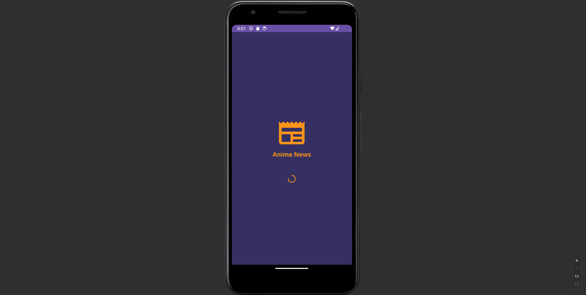
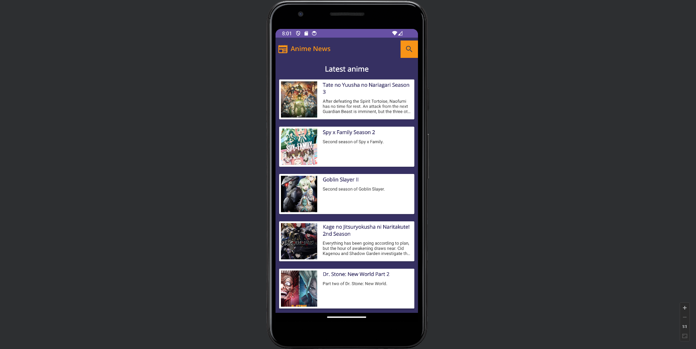
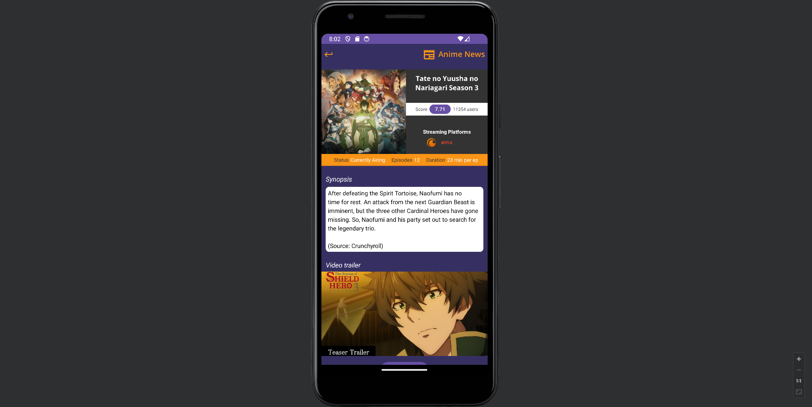
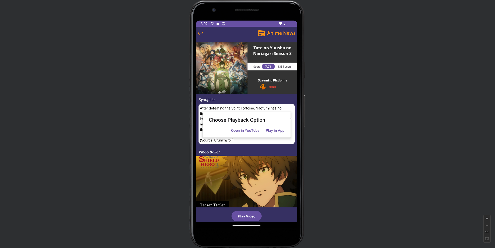
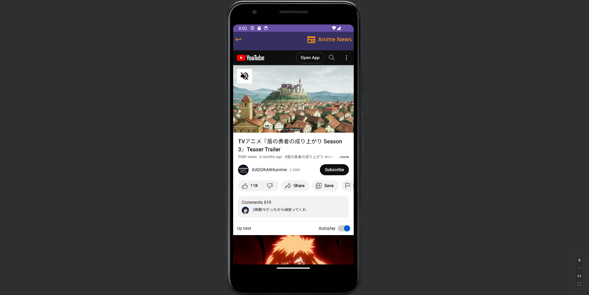
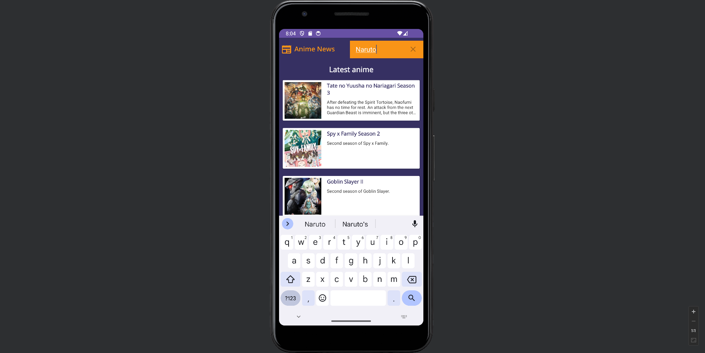
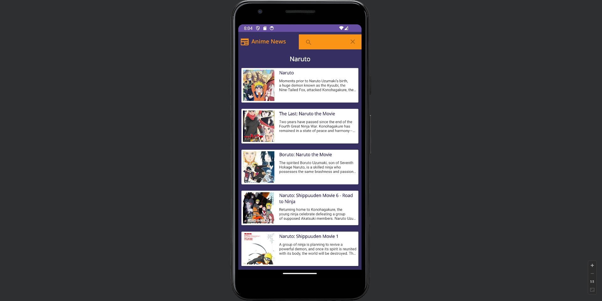
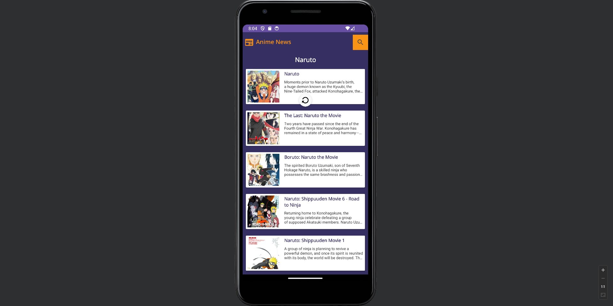

<h3 align="center">Anime News</h3>

## About The Project
Anime News is an application built with Java, dedicated to providing the latest and most exciting anime news, trailers, and information.

## Features
- Latest anime releases
- Detailed anime information
- Watch trailers within the app
- Convenient search function
- Easy navigation

## App Preview

The app starts with a loading screen

You'll land on the home page featuring the latest anime releases

Select any anime from the list to access detailed information.

You can watch trailers for your favorite anime

You have the option to watch trailers through this app

If you prefer watching the trailers on YouTube, simply choose the "Open in YouTube" option

Looking for a specific anime? Use the search feature to find it quickly

Here are the search results for "Naruto" 

If you want to return to the main menu for the latest anime updates, just slide down to reload the app and stay up to date

